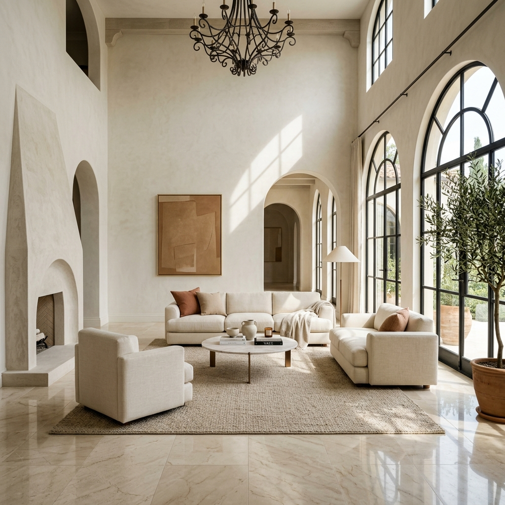

# FullCircle Studio

> **"No corner cuts."** — A premium, cinematic interior design studio website built with Next.js, Framer Motion, and React Three Fiber.



## 🏛️ Project Overview

FullCircle Studio is a high-end interior design and architectural visualization platform. This repository contains the complete frontend implementation, featuring bespoke animations, interactive 3D elements, and a minimalist editorial aesthetic that reflects the studio's commitment to precision and luxury.

## 🚀 Key Features

- **Cinematic Shutter Intro**: A custom circular "aperture" shutter animation reveals the site upon entry.
- **Interactive 3D Hero**: Floating architectural geometries rendered with Three.js (R3F) that react to the brand's minimalist theme.
- **Split-Screen Storytelling**: An editorial-style process section that pairs high-resolution architectural imagery (pinned on the left) with smooth-scrolling narrative content (on the right).
- **Fluid Navigation**: A bespoke "Circle Menu" with layout stabilization to prevent scrollbar-induced jitter.
- **Performance Optimized**: Built with Next.js 14, featuring adaptive DPR for 3D renders and optimized asset loading for a Lighthouse-ready experience.

## 🛠️ Tech Stack

- **Framework**: [Next.js 14](https://nextjs.org/) (App Router)
- **Animation**: [Framer Motion](https://www.framer.com/motion/)
- **3D Graphics**: [React Three Fiber](https://r3f.docs.pmnd.rs/) & [Three.js](https://threejs.org/)
- **Styling**: [Tailwind CSS](https://tailwindcss.com/) & [SCSS Modules](https://sass-lang.com/)
- **Typeface**: [Outfit](https://fonts.google.com/specimen/Outfit) & [Inter](https://fonts.google.com/specimen/Inter)

## 📦 Getting Started

### Prerequisites

- Node.js 18.0 or later
- npm / yarn / pnpm

### Installation

1. **Clone the repository:**
   ```bash
   git clone https://github.com/santhanakrishnanstark/fullcirclestudio.git
   cd fullcirclestudio
   ```

2. **Install dependencies:**
   ```bash
   npm install
   ```

3. **Run the development server:**
   ```bash
   npm run dev
   ```

4. **Open the site:**
   Navigate to [http://localhost:3000](http://localhost:3000)

## 🎨 Design Philosophy

The site follows a **Neo-Classical Minimalist** aesthetic. We use a curated color palette:
- `Jet Black`: #1a1a1a
- `White Smoke`: #f5f5f5
- `Accent Red`: #d54e5e
- `Granite Gray`: #6b6762

Every transition and interaction is designed to feel "editorial"—meaning generous whitespace, bold typography, and smooth, high-frame-rate animations.

## 📄 License

This project is proprietary. All design assets and 3D models are owned by FullCircle Studio.

---

Built with ❤️ by Antigravity for santhanakrishnanstark.
